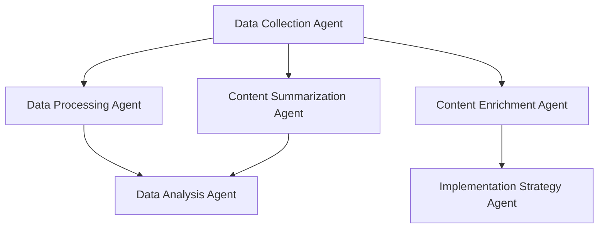

# Rigs

[English](./README.md) | [中文](./README.zh-CN.md)

Rigs is an Agent orchestration framework based on [Rig](https://crates.io/crates/rig-core), designed for building and managing intelligent agent systems with graph-based workflows. It allows you to create, connect, and orchestrate multiple specialized AI agents, enabling them to collaborate and handle complex task flows.

## Features



- **Graph-based Workflow**: Define workflows and data flows between agents using Directed Acyclic Graphs (DAGs)
- **Conditional Flow Transitions**: Support conditional flow transitions and data transformations
- **Multi-Agent Collaboration**: Easily connect multiple specialized agents to form powerful agent networks
- **Multiple Starting Agents**: Support for executing workflows with multiple entry points
- **Persistence Support**: Built-in conversation and state persistence
- **Visualization Export**: Export workflows to Graphviz DOT format for visualization
- **Flexible Agent Configuration**: Easily configure agent parameters through the builder pattern
- **Team Workflows**: Higher-level abstraction for team-based workflows with leader agents

## Installation

Add the following to your `Cargo.toml` file:

```toml
[dependencies]
rigs = "0.0.7"
```

## Quick Start

Here's a simple example showing how to create and connect multiple agents:

```rust
use std::sync::Arc;

use anyhow::Result;
use rigs::agent::Agent;
use rigs::graph_workflow::{DAGWorkflow, Flow};
use rigs::llm_provider::LLMProvider;
use rigs::rig_agent::RigAgent;

#[tokio::main]
async fn main() -> Result<()> {
    dotenv::dotenv().ok();

    let subscriber = tracing_subscriber::fmt::Subscriber::builder()
        .with_env_filter(tracing_subscriber::EnvFilter::from_default_env())
        .with_line_number(true)
        .with_file(true)
        .finish();
    tracing::subscriber::set_global_default(subscriber)?;

    let provider = LLMProvider::deepseek("deepseek-chat");

    let data_collection_agent = RigAgent::deepseek_builder()
        .provider(provider.clone())?
        .agent_name("Data Collection Agent")
        .system_prompt(r#"
            You are a Data Collection Agent. Your primary function is to gather requested information from various sources.

            When given a query or topic, you will:
            1. Identify the key information requirements
            2. Collect relevant data points based on your knowledge
            3. Organize the collected information in a structured format
            4. List any relevant sources or additional context

            Your responses should be factual, comprehensive, and relevant to the query.
            Format your output with clear sections and bullet points when appropriate.
            Always end with "DATA_COLLECTION_COMPLETE" to signal that your data gathering is finished.
        "#)
        .user_name("M4n5ter")
        .max_loops(1) // default is 1
        .temperature(0.1)
        .enable_autosave()
        .save_state_dir("./temp")
        .build()?;

    let data_processing_agent = RigAgent::deepseek_builder()
        .provider(provider.clone())?
        .agent_name("Data Processing Agent")
        .user_name("M4n5ter")
        .system_prompt(r#"
            You are a Data Processing Agent. Your role is to transform raw data into more useful structured information.

            When given input data, you will:
            1. Identify and parse the key components in the input
            2. Clean the data (remove duplicates, fix formatting issues, etc.)
            3. Categorize and tag information by type and relevance
            4. Extract key entities, metrics, and relationships
            5. Transform the data into a consistent JSON format

            Your output should always follow this structure:
            {
            "processed_data": {
                "entities": [...],
                "categories": {...},
                "metrics": {...},
                "relationships": [...]
            },
            "metadata": {
                "processing_steps": [...],
                "confidence_score": 0.0-1.0
            }
            }

            Always maintain factual accuracy while improving the structure and usability of the data.
        "#)
        .enable_autosave()
        .temperature(0.1)
        .save_state_dir("./temp")
        .build()?;

    let content_summarization_agent = RigAgent::deepseek_builder()
        .provider(provider.clone())?
        .agent_name("Content Summarization Agent")
        .user_name("M4n5ter")
        .system_prompt(r#"
            You are a Summarization Agent. Your purpose is to condense information while preserving key insights.

            When given content to summarize, you will:
            1. Identify the main topic and core message
            2. Extract the most important points and supporting details
            3. Eliminate redundancies and non-essential information
            4. Create a concise summary in proportion to the input length
            5. Preserve the original tone and factual accuracy

            Your summary should include:
            - A one-sentence TL;DR
            - 3-5 key points in bullet form
            - A short paragraph that synthesizes the information

            For longer or complex inputs, organize your summary with appropriate headings.
            Always maintain objectivity and avoid introducing new information not present in the original content.
        "#)
        .enable_autosave()
        .temperature(1.0)
        .save_state_dir("./temp")
        .build()?;

    let mut workflow = DAGWorkflow::new("Graph Swarm", "A graph swarm workflow");

    // register agents
    vec![
        data_collection_agent.clone(),
        data_processing_agent.clone(),
        content_summarization_agent.clone(),
    ]
    .into_iter()
    .map(Arc::new)
    .for_each(|a| workflow.register_agent(a));

    // connect agents
    // Data Collection Agent -> Data Processing Agent
    // Data Collection Agent -> Content Summarization Agent
    let _edge_idx1 = workflow
        .connect_agents(
            &data_collection_agent.name(),
            &data_processing_agent.name(),
            Flow::default(),
        )
        .unwrap();

    // Add a conditional flow with transformation
    let conditional_flow = Flow {
        // Add a custom transformation function, this will change the output of the previous agent
        // to a new format that will be used as the input of the next agent.
        transform: Some(Arc::new(|output| format!("Summary request: {}", output))),
        // Add a condition, this will only trigger the next agent if the output of the previous agent
        // is longer than 100 characters. If the condition is not met, the workflow will continue
        // to the next agent in the graph. This is useful to avoid expensive computations if the
        // input is too short.
        condition: Some(Arc::new(|output| output.len() > 100)),
    };
    let _edge_idx2 = workflow
        .connect_agents(
            &data_collection_agent.name(),
            &content_summarization_agent.name(),
            conditional_flow,
        )
        .unwrap();

    // Get workflow structure
    let worlflow_structure = workflow.get_workflow_structure();
    println!("{worlflow_structure:#?}");

    // Export to Graphviz DOT format for visualization
    let dot = workflow.export_workflow_dot();
    println!(
        "https://www.graphviz.org/about/\ngraphviz dot format: \n{dot}\nviewer: https://magjac.com/graphviz-visual-editor/"
    );

    // Execute the workflow with a single starting agent
    let results = workflow
        .execute_workflow(
            &[&data_collection_agent.name()],
            "How to build a graph database?",
        )
        .await
        .unwrap();

    println!("{results:#?}");
    Ok(())
}
```

## Advanced Usage

### Multiple Starting Agents

```rust
// Execute workflow with multiple starting agents
let results = workflow
    .execute_workflow(
        &[&agent1.name(), &agent2.name()],
        "Process this input with multiple approaches",
    )
    .await
    .unwrap();
```

### Conditional Flows and Data Transformation

```rust
// Add flow with condition and transformation
let conditional_flow = Flow {
    // Add custom transformation function
    transform: Some(Arc::new(|output| format!("Transformed output: {}", output))),
    // Add condition, only trigger next agent if previous agent's output length > 100
    condition: Some(Arc::new(|output| output.len() > 100)),
};

workflow.connect_agents(
    &agent1.name(),
    &agent2.name(),
    conditional_flow,
).unwrap();
```

### Team Workflows

```rust
use rigs::team_workflow::TeamWorkflow;
use rigs::llm_provider::LLMProvider;

// Create a team workflow
let mut team = TeamWorkflow::new("Research Team", "A team for research tasks");

// Register models
team.register_model(
    "deepseek-chat",
    LLMProvider::deepseek("deepseek-chat"),
    ModelDescription {
        name: "deepseek-chat".to_string(),
        description: "General purpose model".to_string(),
        capabilities: vec!["reasoning".to_string(), "writing".to_string()],
        context_window: 8192,
        max_tokens: 2048,
    },
);

// Get default system prompt and orchestration tool for the leader agent
let (default_system_prompt, default_tool) = team.default_leader_system_prompt_and_tool();

// Set leader agent with the default system prompt and orchestration tool
let leader = RigAgent::deepseek_builder()
    .provider(LLMProvider::deepseek("deepseek-chat"))?
    .agent_name("Team Leader")
    .system_prompt(default_system_prompt)
    .tool(default_tool)?
    .build()?;

team.set_leader(Arc::new(leader));

// Execute the team workflow
let results = team.execute("Research quantum computing applications").await?;
```

### Workflow Visualization

```rust
// Get workflow structure
let workflow_structure = workflow.get_workflow_structure();
println!("{workflow_structure:#?}");

// Export to Graphviz DOT format
let dot = workflow.export_workflow_dot();
println!("Graphviz DOT format: \n{dot}");
// Visualize at https://magjac.com/graphviz-visual-editor/
```

## Examples

See the [examples](./examples) directory for more examples.

## License

This project is licensed under the [MIT License](./LICENSE).

---

