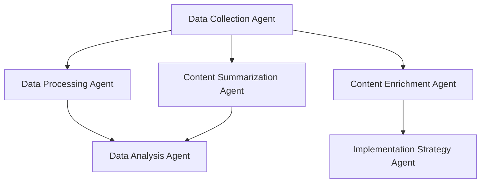

# Rigs

[English](./README.md) | [中文](./README.zh-CN.md)

Rigs 是一个基于 [Rig](https://crates.io/crates/rig-core) 的智能体编排框架，用于构建和管理基于图工作流的智能体系统。它允许您创建、连接和编排多个专门的AI智能体，使它们能够协作处理复杂的任务流程。

## 功能特性



- **基于图的工作流**: 使用有向无环图（DAG）定义智能体之间的工作流和数据流
- **条件流转换**: 支持条件流转换和数据转换
- **多智能体协作**: 轻松连接多个专门的智能体，形成强大的智能体网络
- **多起始智能体**: 支持从多个入口点执行工作流
- **持久化支持**: 内置对话和状态持久化功能
- **可视化导出**: 将工作流导出为Graphviz DOT格式以进行可视化
- **灵活的智能体配置**: 通过构建器模式轻松配置智能体参数
- **团队工作流**: 基于团队的工作流高级抽象，支持领导者智能体

## 安装

在您的 `Cargo.toml` 文件中添加以下内容：

```toml
[dependencies]
rigs = "0.0.7"
```

## 快速开始

以下是一个简单的示例，展示如何创建和连接多个智能体：

```rust
use std::sync::Arc;

use anyhow::Result;
use rigs::agent::Agent;
use rigs::graph_workflow::{DAGWorkflow, Flow};
use rigs::llm_provider::LLMProvider;
use rigs::rig_agent::RigAgent;

#[tokio::main]
async fn main() -> Result<()> {
    dotenv::dotenv().ok();

    let subscriber = tracing_subscriber::fmt::Subscriber::builder()
        .with_env_filter(tracing_subscriber::EnvFilter::from_default_env())
        .with_line_number(true)
        .with_file(true)
        .finish();
    tracing::subscriber::set_global_default(subscriber)?;

    let provider = LLMProvider::deepseek("deepseek-chat");

    let data_collection_agent = RigAgent::deepseek_builder()
        .provider(provider.clone())?
        .agent_name("数据收集智能体")
        .system_prompt(r#"
            您是一个数据收集智能体。您的主要功能是从各种来源收集所需的信息。

            当收到查询或主题时，您将：
            1. 识别关键信息需求
            2. 根据您的知识收集相关数据点
            3. 以结构化格式组织收集的信息
            4. 列出任何相关的来源或附加上下文

            您的响应应真实、全面且与查询相关。
            在适当时使用清晰的部分和项目符号格式化您的输出。
            始终以"DATA_COLLECTION_COMPLETE"结束，以表示您的数据收集已完成。
        "#)
        .user_name("M4n5ter")
        .max_loops(1) // 默认值为1
        .temperature(0.1)
        .enable_autosave()
        .save_state_dir("./temp")
        .build()?;

    let data_processing_agent = RigAgent::deepseek_builder()
        .provider(provider.clone())?
        .agent_name("数据处理智能体")
        .user_name("M4n5ter")
        .system_prompt(r#"
            您是一个数据处理智能体。您的角色是将原始数据转换为更有用的结构化信息。

            当收到输入数据时，您将：
            1. 识别并解析输入中的关键组件
            2. 清理数据（删除重复项，修复格式问题等）
            3. 按类型和相关性对信息进行分类和标记
            4. 提取关键实体、指标和关系
            5. 将数据转换为一致的JSON格式

            您的输出应始终遵循以下结构：
            {
            "processed_data": {
                "entities": [...],
                "categories": {...},
                "metrics": {...},
                "relationships": [...]
            },
            "metadata": {
                "processing_steps": [...],
                "confidence_score": 0.0-1.0
            }
            }

            在提高数据结构和可用性的同时，始终保持事实的准确性。
        "#)
        .enable_autosave()
        .temperature(0.1)
        .save_state_dir("./temp")
        .build()?;

    let content_summarization_agent = RigAgent::deepseek_builder()
        .provider(provider.clone())?
        .agent_name("内容摘要智能体")
        .user_name("M4n5ter")
        .system_prompt(r#"
            您是一个摘要智能体。您的目的是在保留关键见解的同时压缩信息。

            当收到要摘要的内容时，您将：
            1. 识别主要主题和核心信息
            2. 提取最重要的要点和支持细节
            3. 消除冗余和非必要信息
            4. 根据输入长度创建相应比例的简明摘要
            5. 保持原始语气和事实准确性

            您的摘要应包括：
            - 一句话的TL;DR
            - 3-5个关键要点，以项目符号形式列出
            - 一段简短的段落，综合信息

            对于较长或复杂的输入，使用适当的标题组织您的摘要。
            始终保持客观性，避免引入原始内容中不存在的新信息。
        "#)
        .enable_autosave()
        .temperature(1.0)
        .save_state_dir("./temp")
        .build()?;

    let mut workflow = DAGWorkflow::new("Graph Swarm", "A graph swarm workflow");

    // 注册智能体
    vec![
        data_collection_agent.clone(),
        data_processing_agent.clone(),
        content_summarization_agent.clone(),
    ]
    .into_iter()
    .map(Arc::new)
    .for_each(|a| workflow.register_agent(a));

    // 连接智能体
    // 数据收集智能体 -> 数据处理智能体
    // 数据收集智能体 -> 内容摘要智能体
    let _edge_idx1 = workflow
        .connect_agents(
            &data_collection_agent.name(),
            &data_processing_agent.name(),
            Flow::default(),
        )
        .unwrap();

    // 添加带有条件的流和转换
    let conditional_flow = Flow {
        // 添加自定义转换函数，这将改变前一个智能体的输出
        // 为下一个智能体的输入使用的新格式。
        transform: Some(Arc::new(|output| format!("摘要请求: {}", output))),
        // 添加条件，只有当前一个智能体的输出长度大于100个字符时才触发下一个智能体。
        // 如果条件不满足，工作流将继续到图中的下一个智能体。
        // 这对于避免在输入太短时进行昂贵的计算很有用。
        condition: Some(Arc::new(|output| output.len() > 100)),
    };
    let _edge_idx2 = workflow
        .connect_agents(
            &data_collection_agent.name(),
            &content_summarization_agent.name(),
            conditional_flow,
        )
        .unwrap();

    // 获取工作流结构
    let worlflow_structure = workflow.get_workflow_structure();
    println!("{worlflow_structure:#?}");

    // 导出为Graphviz DOT格式以进行可视化
    let dot = workflow.export_workflow_dot();
    println!(
        "https://www.graphviz.org/about/\ngraphviz dot format: \n{dot}\nviewer: https://magjac.com/graphviz-visual-editor/"
    );

    // 使用单个起始智能体执行工作流
    let results = workflow
        .execute_workflow(
            &[&data_collection_agent.name()],
            "如何构建图数据库？",
        )
        .await
        .unwrap();

    println!("{results:#?}");
    Ok(())
}
```

## 高级用法

### 多起始智能体

```rust
// 使用多个起始智能体执行工作流
let results = workflow
    .execute_workflow(
        &[&agent1.name(), &agent2.name()],
        "使用多种方法处理此输入",
    )
    .await
    .unwrap();
```

### 条件流和数据转换

```rust
// 添加带有条件和转换的流
let conditional_flow = Flow {
    // 添加自定义转换函数
    transform: Some(Arc::new(|output| format!("转换后的输出: {}", output))),
    // 添加条件，只有当前一个智能体的输出长度大于100时才触发下一个智能体
    condition: Some(Arc::new(|output| output.len() > 100)),
};

workflow.connect_agents(
    &agent1.name(),
    &agent2.name(),
    conditional_flow,
).unwrap();
```

### 团队工作流

```rust
use rigs::team_workflow::TeamWorkflow;
use rigs::llm_provider::LLMProvider;

// 创建团队工作流
let mut team = TeamWorkflow::new("研究团队", "用于研究任务的团队");

// 注册模型
team.register_model(
    "deepseek-chat",
    LLMProvider::deepseek("deepseek-chat"),
    ModelDescription {
        name: "deepseek-chat".to_string(),
        description: "通用模型".to_string(),
        capabilities: vec!["推理".to_string(), "写作".to_string()],
        context_window: 8192,
        max_tokens: 2048,
    },
);

// 获取领导者智能体的默认系统提示和编排工具
let (default_system_prompt, default_tool) = team.default_leader_system_prompt_and_tool();

// 设置领导者智能体，使用默认系统提示和编排工具
let leader = RigAgent::deepseek_builder()
    .provider(LLMProvider::deepseek("deepseek-chat"))?
    .agent_name("团队领导")
    .system_prompt(default_system_prompt)
    .tool(default_tool)?
    .build()?;

team.set_leader(Arc::new(leader));

// 执行团队工作流
let results = team.execute("研究量子计算应用").await?;
```

### 工作流可视化

```rust
// 获取工作流结构
let workflow_structure = workflow.get_workflow_structure();
println!("{workflow_structure:#?}");

// 导出为Graphviz DOT格式
let dot = workflow.export_workflow_dot();
println!("Graphviz DOT格式: \n{dot}");
// 在 https://magjac.com/graphviz-visual-editor/ 上可视化
```

## 示例

查看[examples](./examples)目录获取更多示例。

## 许可证

本项目采用[MIT许可证](./LICENSE)。

---