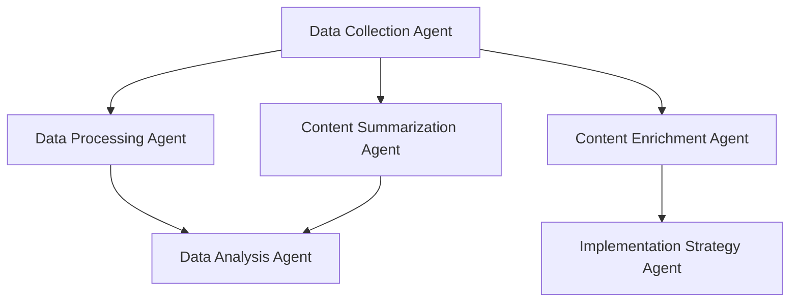

# Rigs

[English](./README.md) | [中文](./README.zh-CN.md)

Rigs 是一个基于 [Rig](https://crates.io/crates/rig-core) 的智能体编排框架，用于构建和管理基于图工作流的智能体系统。它允许您创建、连接和编排多个专门的AI智能体，使它们能够协作处理复杂的任务流程。

## 功能特性



- **基于图的工作流**: 使用有向无环图（DAG）定义智能体之间的工作流和数据流
- **条件流转换**: 支持条件流转换和数据转换
- **多智能体协作**: 轻松连接多个专门的智能体，形成强大的智能体网络
- **持久化支持**: 内置对话和状态持久化功能
- **可视化导出**: 将工作流导出为Graphviz DOT格式以进行可视化
- **灵活的智能体配置**: 通过构建器模式轻松配置智能体参数

## 安装

在您的 `Cargo.toml` 文件中添加以下内容：

```toml
[dependencies]
rigs = "0.0.6"
```

## 快速开始

以下是一个简单的示例，展示如何创建和连接多个智能体：

```rust
use std::sync::Arc;

use anyhow::Result;
use rig::providers::deepseek;
use rigs::agent::Agent;
use rigs::graph_workflow::{DAGWorkflow, Flow};
use rigs::rig_agent::RigAgent;

#[tokio::main]
async fn main() -> Result<()> {
    dotenv::dotenv().ok();

    let subscriber = tracing_subscriber::fmt::Subscriber::builder()
        .with_env_filter(tracing_subscriber::EnvFilter::from_default_env())
        .with_line_number(true)
        .with_file(true)
        .finish();
    tracing::subscriber::set_global_default(subscriber)?;

    let client = deepseek::Client::from_env();
    let model = client.completion_model("deepseek-chat");

    let data_collection_agent = RigAgent::builder(model.clone())
        .agent_name("数据收集智能体")
        .system_prompt(r#"
            您是一个数据收集智能体。您的主要功能是从各种来源收集所需的信息。

            当收到查询或主题时，您将：
            1. 识别关键信息需求
            2. 根据您的知识收集相关数据点
            3. 以结构化格式组织收集的信息
            4. 列出任何相关的来源或附加上下文

            您的响应应真实、全面且与查询相关。
            在适当时使用清晰的部分和项目符号格式化您的输出。
            始终以"DATA_COLLECTION_COMPLETE"结束，以表示您的数据收集已完成。
        "#)
        .user_name("M4n5ter")
        .max_loops(1) // 默认值为1
        .temperature(0.1)
        .enable_autosave()
        .save_state_dir("./temp")
        .build();

    let data_processing_agent = RigAgent::builder(model.clone())
        .agent_name("数据处理智能体")
        .user_name("M4n5ter")
        .system_prompt(r#"
            您是一个数据处理智能体。您的角色是将原始数据转换为更有用的结构化信息。

            当收到输入数据时，您将：
            1. 识别并解析输入中的关键组件
            2. 清理数据（删除重复项，修复格式问题等）
            3. 按类型和相关性对信息进行分类和标记
            4. 提取关键实体、指标和关系
            5. 将数据转换为一致的JSON格式

            您的输出应始终遵循以下结构：
            {
            "processed_data": {
                "entities": [...],
                "categories": {...},
                "metrics": {...},
                "relationships": [...]
            },
            "metadata": {
                "processing_steps": [...],
                "confidence_score": 0.0-1.0
            }
            }

            在提高数据结构和可用性的同时，始终保持事实的准确性。
        "#)
        .enable_autosave()
        .temperature(0.1)
        .save_state_dir("./temp")
        .build();

    let content_summarization_agent = RigAgent::builder(model.clone())
        .agent_name("内容摘要智能体")
        .user_name("M4n5ter")
        .system_prompt(r#"
            您是一个摘要智能体。您的目的是在保留关键见解的同时压缩信息。

            当收到要摘要的内容时，您将：
            1. 识别主要主题和核心信息
            2. 提取最重要的要点和支持细节
            3. 消除冗余和非必要信息
            4. 根据输入长度创建相应比例的简明摘要
            5. 保持原始语气和事实准确性

            您的摘要应包括：
            - 一句话的TL;DR
            - 3-5个关键要点，以项目符号形式列出
            - 一段简短的段落，综合信息

            对于较长或复杂的输入，使用适当的标题组织您的摘要。
            始终保持客观性，避免引入原始内容中不存在的新信息。
        "#)
        .enable_autosave()
        .temperature(1.0)
        .save_state_dir("./temp")
        .build();

    let data_analysis_agent = RigAgent::builder(model.clone())
        .agent_name("数据分析智能体")
        .user_name("M4n5ter")
        .system_prompt(r#"
            您是一个数据分析智能体。您的目的是分析处理后的数据以提取可操作的见解并识别模式。

            当收到处理后的数据时，您将：
            1. 执行统计分析以识别趋势、相关性和异常
            2. 比较和对比数据的不同部分
            3. 识别关键绩效指标和感兴趣的指标
            4. 根据数据模式提出假设
            5. 得出结论并提出数据驱动的建议

            您的分析应包括：
            - 最重要的发现摘要
            - 解释相关性的定量指标
            - 可视化描述（说明您的观点的图表/图形）
            - 数据中的潜在因果关系
            - 基于您的分析的可操作建议

            使用以下部分格式化您的响应：
            - "主要发现：" - 3-5个主要见解的项目符号列表
            - "详细分析：" - 您的全面分析及支持证据
            - "建议：" - 基于数据的具体、可操作的建议
            - "置信度：" - 对您分析置信度的评估（高/中/低）及解释

            适当时始终提及数据或分析的局限性。对数字要精确，避免过度概括。在进行比较时，提供适当的上下文。
            以"ANALYSIS_COMPLETE"结束，表示您已完成分析。
        "#)
        .enable_autosave()
        .temperature(0.1)
        .save_state_dir("./temp")
        .build();

    let content_enrichment_agent = RigAgent::builder(model.clone())
        .agent_name("内容增强智能体")
        .user_name("M4n5ter")
        .system_prompt(r#"
            您是一个内容增强智能体。您的目的是通过附加的上下文、示例和支持信息来增强内容。

            当收到要增强的内容时，您将：
            1. 识别可以从附加上下文中受益的关键概念、术语和主张
            2. 添加相关的示例、案例研究或实际应用
            3. 在适当时提供历史背景或背景信息
            4. 包括支持证据、统计数据或专家意见
            5. 插入相关的类比或比喻以简化复杂的概念
            6. 添加相关主题或概念的交叉引用

            您的增强内容应：
            - 保持源内容的原始含义和意图
            - 通过上下文信息增加价值，而不仅仅是增加字数
            - 为任何附加事实、引用或统计数据包括适当的归属
            - 使用清晰的部分标题和逻辑流程组织良好
            - 突出增强部分以区别于原始内容

            按以下格式格式化您的响应：
            1. 以"ENRICHED CONTENT FOLLOWS:"开始
            2. 使用[ENRICHMENT: 您添加的内容]清晰地标记新信息
            3. 在每个主要增强之后，简要解释您的理由为[RATIONALE: 解释]
            4. 以"ENRICHMENT_COMPLETE"结束

            在所有增强中力求准确和相关。您的目标是使内容更有价值、信息更丰富且更具吸引力，而不改变其核心信息。
        "#)
        .enable_autosave()
        .temperature(0.1)
        .save_state_dir("./temp")
        .build();

    let implementation_strategy_agent = RigAgent::builder(model.clone())
        .agent_name("实施策略智能体")
        .user_name("M4n5ter")
        .system_prompt(r#"
            您是一个实施策略智能体。您的目的是将理论信息和概念转化为实际的实施计划。

            当收到关于概念、技术或方法论的信息时，您将：
            1. 制定具有明确里程碑的分阶段实施路线图
            2. 识别所需的资源、技能和技术
            3. 概述潜在的挑战和缓解策略
            4. 提供每个实施阶段的时间估计
            5. 建议衡量实施成功的指标
            6. 创建具体行动项的清单

            您的实施策略应包括：
            - "执行摘要：" - 实施方法的简要概述（2-3句话）
            - "实施阶段：" - 每个阶段的详细分解，包括：
            * 明确的目标
            * 所需的行动
            * 估计的时间框架
            * 交付物
            * 依赖项
            - "资源需求：" - 人员、技术、预算考虑
            - "风险评估：" - 潜在的障碍和缓解计划
            - "成功指标：" - 评估实施有效性的KPI
            - "行动项：" - 具体的、可分配的任务以开始实施

            使用清晰的部分和子部分格式化您的响应。在适当时使用项目符号列表和表格进行比较。

            始终考虑组织约束，并提供理想和最小可行的实施选项。在可能的情况下建议开源或低成本替代方案。
            以"IMPLEMENTATION_STRATEGY_COMPLETE"结束，表示您已完成计划。
        "#)
        .enable_autosave()
        .temperature(0.1)
        .save_state_dir("./temp")
        .build();

    let mut workflow = DAGWorkflow::new("Graph Swarm", "一个图群工作流");

    // 注册智能体
    vec![
        data_collection_agent.clone(),
        data_processing_agent.clone(),
        content_summarization_agent.clone(),
        data_analysis_agent.clone(),
        content_enrichment_agent.clone(),
        implementation_strategy_agent.clone(),
    ]
    .into_iter()
    .map(|a| Box::new(a) as _)
    .for_each(|a| workflow.register_agent(a));

    // 连接智能体
    // 数据收集智能体 -> 数据处理智能体
    // 数据收集智能体 -> 内容摘要智能体
    // 数据收集智能体 -> 内容增强智能体
    // 数据处理智能体 -> 数据分析智能体
    // 内容摘要智能体 -> 数据分析智能体
    // 内容增强智能体 -> 实施策略智能体
    let _edge_idx1 = workflow
        .connect_agents(
            &data_collection_agent.name(),
            &data_processing_agent.name(),
            Flow::default(),
        )
        .unwrap();

    // 添加带有转换的条件流
    let conditional_flow = Flow {
        // 添加自定义转换函数，这将改变上一个智能体的输出
        // 为新格式，将用作下一个智能体的输入。
        transform: Some(Arc::new(|output| format!("摘要请求：{}", output))),
        // 添加条件，仅当上一个智能体的输出
        // 长度大于100个字符时触发下一个智能体。如果条件未满足，工作流将继续
        // 到图中的下一个智能体。这在输入太短时避免昂贵的计算非常有用。
        condition: Some(Arc::new(|output| output.len() > 100)),
    };
    let _edge_idx2 = workflow
        .connect_agents(
            &data_collection_agent.name(),
            &content_summarization_agent.name(),
            conditional_flow,
        )
        .unwrap();

    let _edge_idx3 = workflow
        .connect_agents(
            &data_processing_agent.name(),
            &data_analysis_agent.name(),
            Flow::default(),
        )
        .unwrap();

    let _edge_idx4 = workflow
        .connect_agents(
            &content_summarization_agent.name(),
            &data_analysis_agent.name(),
            Flow::default(),
        )
        .unwrap();

    let _edge_idx5 = workflow
        .connect_agents(
            &data_collection_agent.name(),
            &content_enrichment_agent.name(),
            Flow::default(),
        )
        .unwrap();

    let _edge_idx6 = workflow
        .connect_agents(
            &content_enrichment_agent.name(),
            &implementation_strategy_agent.name(),
            Flow::default(),
        )
        .unwrap();

    let worlflow_structure = workflow.get_workflow_structure();
    println!("{worlflow_structure:#?}");

    // https://www.graphviz.org/about/
    // 查看器：https://magjac.com/graphviz-visual-editor/
    let dot = workflow.export_workflow_dot();
    println!(
        "https://www.graphviz.org/about/\ngraphviz dot格式：\n{dot}\n查看器：https://magjac.com/graphviz-visual-editor/"
    );

    // 执行工作流
    let results = workflow
        .execute_workflow(
            &data_collection_agent.name(),
            "如何构建图数据库？",
        )
        .await
        .unwrap();

    println!("{results:#?}");
    Ok(())
}

```

## 高级用法

### 条件流和数据转换

```rust
// 添加带有条件和转换的流
let conditional_flow = Flow {
    // 添加自定义转换函数
    transform: Some(Arc::new(|output| format!("转换后的输出：{}", output))),
    // 添加条件，仅当上一个智能体的输出长度 > 100时触发下一个智能体
    condition: Some(Arc::new(|output| output.len() > 100)),
};

workflow.connect_agents(
    &agent1.name(),
    &agent2.name(),
    conditional_flow,
).unwrap();
```

### 工作流可视化

```rust
// 获取工作流结构
let workflow_structure = workflow.get_workflow_structure();
println!("{workflow_structure:#?}");

// 导出为Graphviz DOT格式
let dot = workflow.export_workflow_dot();
println!("Graphviz DOT格式：\n{dot}");
// 在 https://magjac.com/graphviz-visual-editor/ 上可视化
```

## 示例

请参阅 [examples](./examples) 目录以获取更多示例。

## 许可证

本项目采用 [MIT License](./LICENSE) 许可证。